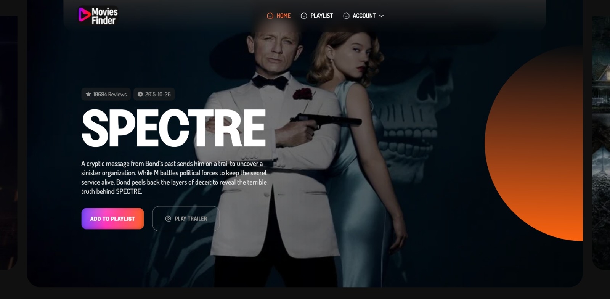
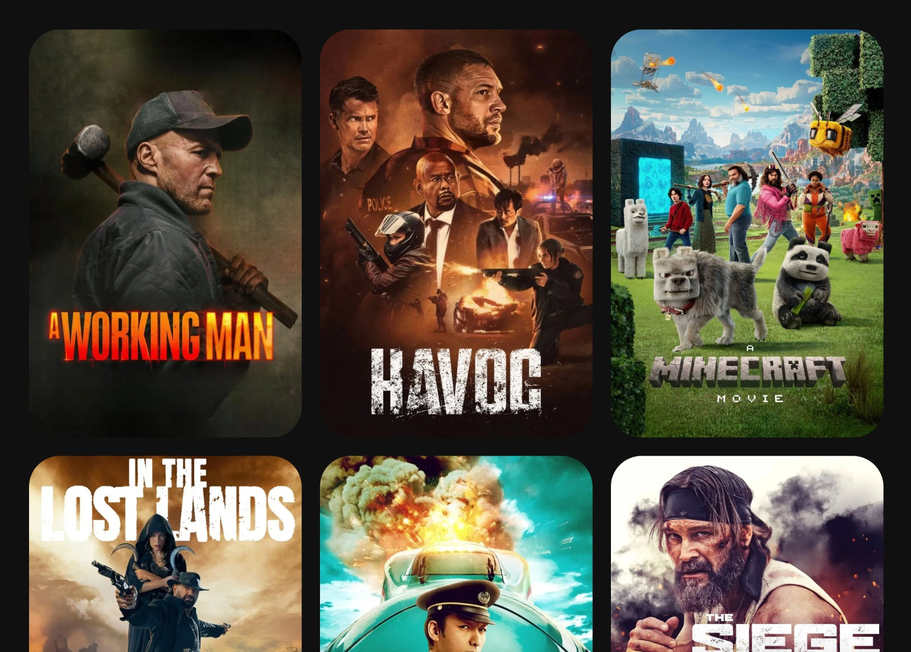
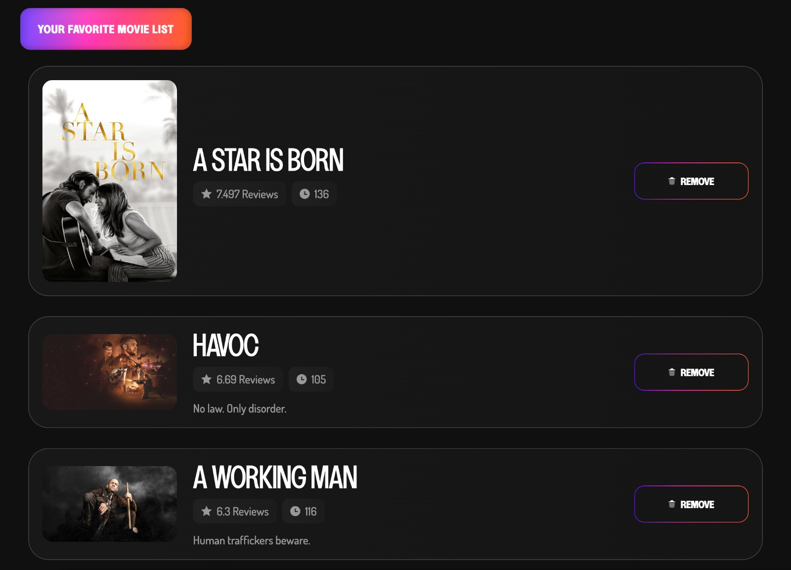

## Getting Started

First, run the development server:


## Screenshots






This is a [Next.js](https://nextjs.org/) project bootstrapped with [`create-next-app`](https://github.com/vercel/next.js/tree/canary/packages/create-next-app).

## Getting Started

First, run the development server:

```bash
npm run dev
```

## Playwright tests 

```bash
npm test:e2e
```

Open [http://localhost:3000](http://localhost:3000) with your browser to see the result.

## Deployed on Firebase

https://movies-finder-ee860.web.app/

## Roadmap

1. Fix images optimization.
2. Add Loaders for better UX/UI.
3. SSR enchachments.


